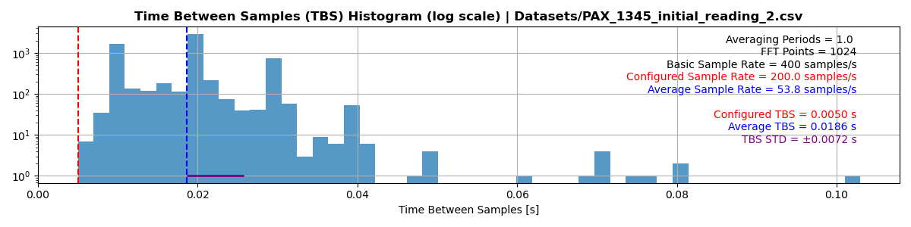

## Portfolio

---

### PAX rate visualization

Description

[View code on Github](https://github.com/evanshaped/PAX-rate-visualization)

---

### Polarization drift research in Britton Laboratory

Description

[View code on Github](https://github.com/evanshaped/BrittonPolRepo)

---

### Category Name 1 

[Project 1 Title](/sample_page)

---
[Project 2 Title](/pdf/sample_presentation.pdf)

---
[Project 3 Title](http://example.com/)

---

### Category Name 2

- [Project 1 Title](http://example.com/)
- [Project 2 Title](http://example.com/)
- [Project 3 Title](http://example.com/)
- [Project 4 Title](http://example.com/)
- [Project 5 Title](http://example.com/)

---
